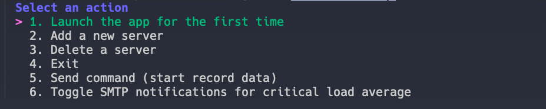

# 🌐 ServMon

**ServMon** is a powerful application designed to collect and display server statistics for user-inputted servers. Built with the **Gin framework**, it provides a sleek web interface to visualize key performance metrics.

## 📊 Features

-   **Real-time Monitoring**: Collects and displays server statistics.
-   **Data Visualization**: Utilizes the Gin framework for a modern web interface.
-   **Performance Metrics**: Stores average RAM, CPU, and memory usage.
-   **Custom Timeframes**: View statistics for the last hour, last 12 hours, and last 24 hours.

## 📸 Screenshots

### Web Interface


### Console Start



## ⚙️ Installation

To successfully install and set up the project, follow the steps below.

### Requirements

-   **PostgreSQL** (can be installed via Docker or native on a Linux server)
-   **Golang** version 1.22.5 or higher
-   **Tmux** for managing terminal sessions

### Launch Steps

1. Open your terminal and create a new Tmux session with the command:

```bash
tmux new -s namesession
```

2. Next, clone the repository and navigate to the project directory:

```bash
git clone https://github.com/Wefdzen/ServMon.git
cd ServMon
```

3. Run the application:

```bash
go run cmd/app/main.go
```

4. Once the server is set up, you can detach from the Tmux session by pressing:

Ctrl + b, then d (default Tmux prefix).

Congratulations! 🎉
Your ServMon is now up and running. You can reattach to the session anytime with:

```bash
tmux attach -t namesession
```

To view your server information, open your browser and navigate to:

```bash
http://<YourServerIP>:8080/test/1/1
```

## 📝 License

MIT License

Copyright (c) 2025 Wefdzen

## 💬 Contact

For questions or feedback, feel free to reach out!
